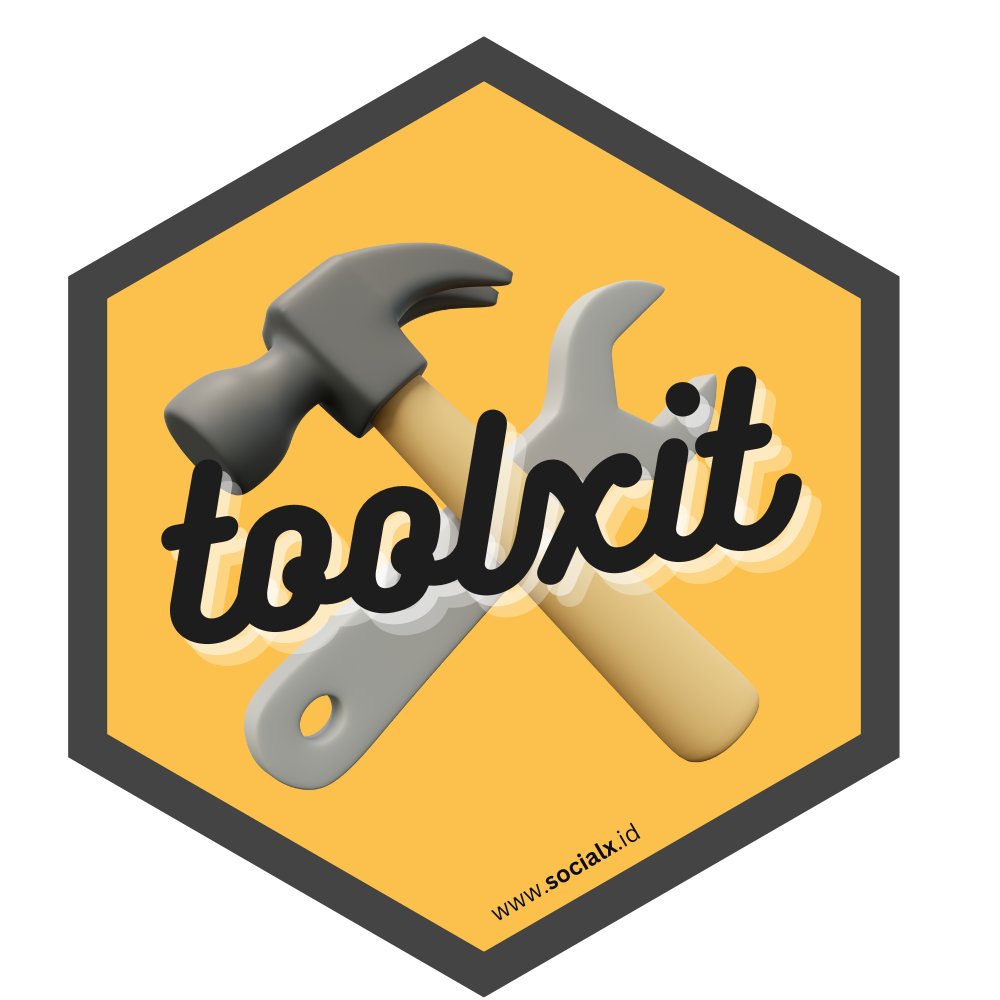

<!-- README.md is generated from README.Rmd. Please edit that file -->

# toolxit </a>

<!-- badges: start -->
<!-- badges: end -->

Toolxit is a collection of tools for carrying out data analysis. Please
check the package documentation for details

## Installation

You can install the development version of toolxit from
[GitHub](https://github.com/) with:

``` r
# install.packages("devtools")
devtools::install_github("socialx-analytics/toolxit")
```
